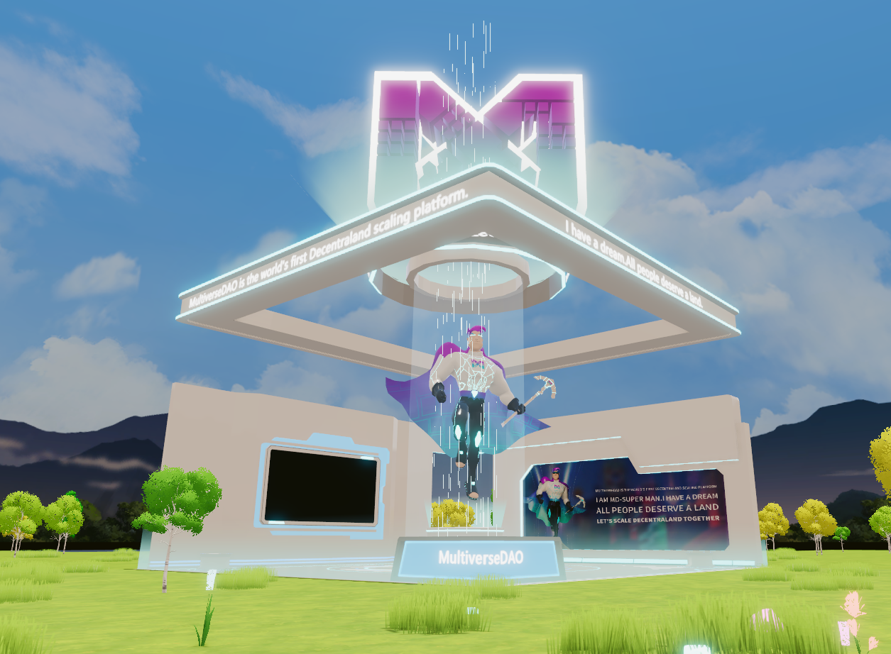

# MultiverseDao showhome-scene

A MultiverseDao showroom, you can get gold coins by simply clicking on the media link, and when you have 4 gold coins, you can open the wearable device market.




This scene shows you:

- How to add 3D models
- How to handle click events
- How to handle the display and accumulation of scores
- How to handle UI opening and closing
- How to handle UI text information
- How to handle video
- How to make an entity rotate with the player


## Try it out

**Install the CLI**

Download and install the MultiverseDao CLI by running the following command:

```bash
npm install @multiversedao/cli -g
```

**Previewing the scene**

Download this example and navigate to its directory, then run:

```
$:  mdl start
```

Any dependencies are installed and then the CLI opens the scene in a new browser tab.